# PanoramaMaker

Godot 4 project that can generate panorama images to be used as sky panorama textures.

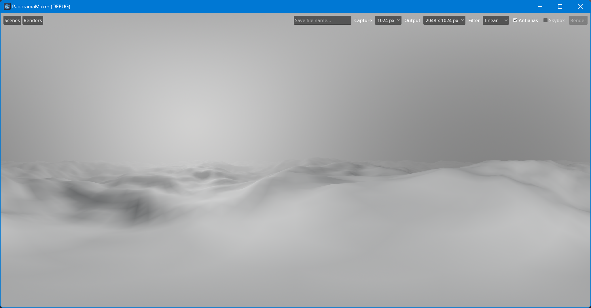

The project comes with 5 sample scenes to play with. You can, of course, make your own.

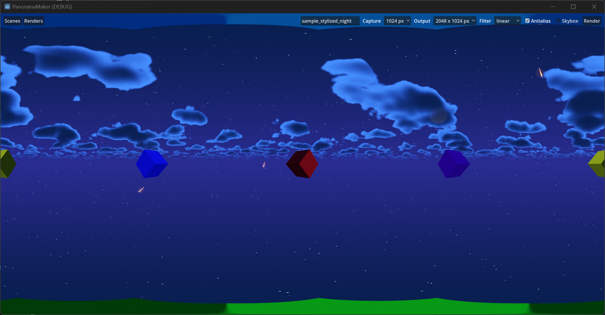

## How do I generate my Panoramas?

### 1. Create your scene

Setup your new custom scene in `res://my_scenes` directory.
This scene can be anything, the only caveat is that you reserve space at the center of the world for the cameras.

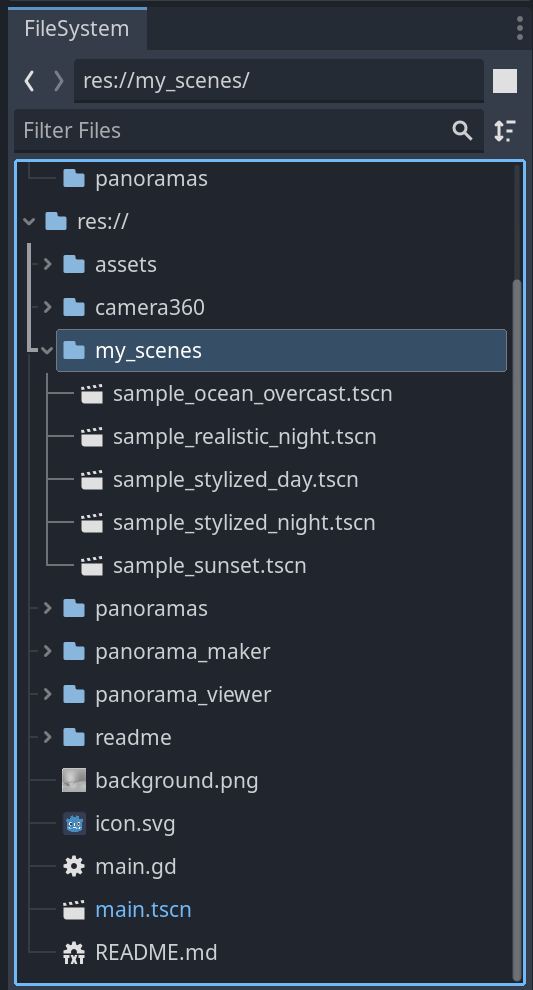

### 2. Name your root node

Give your root node a unique name, as this will be the **default filename** (you can change it later).

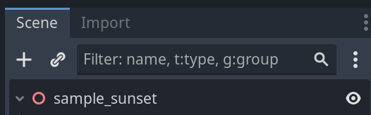

### 3. Run project

Run the project to preview and render your panoramas.

Your scene, if you placed it under `my_scenes` directory, will show up here.

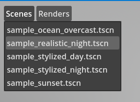

Select a scene to load it, this will preview the panorama rendering.

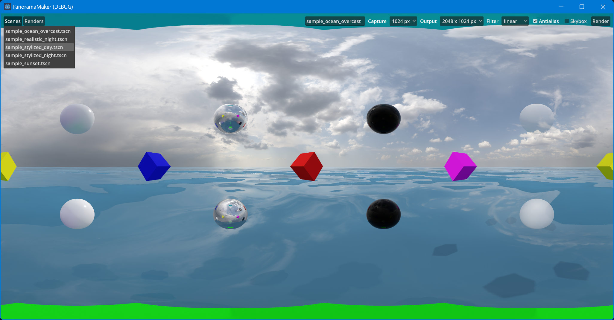

You can customize rendering options in the settings menu.

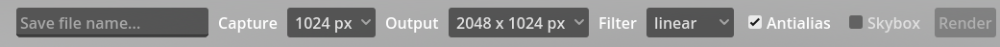

### 4. Rendering panoramas

To render a panorama, set you desired settings and click `Render`.
Optionally, you can check on `Skybox` and 6 separate images that represent a skybox render will also be created alongside the panorama render.

The `Render` buttons will be enabled once a scene is loaded.

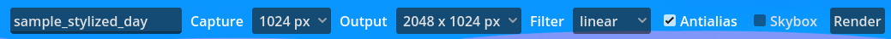

#### Editable options

- **File name** - Default set from root scene node name, customize text for filename export
- **Capture** - Set resolution for each of the cube cameras (capture resolution)
- **Output** - Set resolution of output panorama file (output resolution)
- **Filter** - Choose texture filtering, will render smooth or pixelated image
- **Antialias** - Select if 3D meshes should be antialiased (MSAA 8x)
- **Skybox** - Option to generate 6 separate skybox images as well

### 5. Preview

Once you have clicked `Render`, after a short pause while the image is rendered, a **Panorama preview** popup window will display.

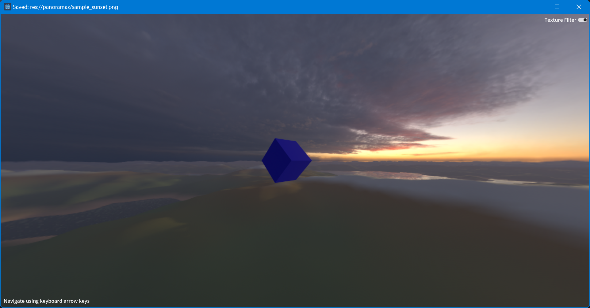

Navigate the panorama preview using the keyboard arrow buttons. Set **Texture Filter** options for the preview from smooth to pixelated, depending on how you like to view the image.

You can select and preview rendered panorama images at any time from the `Renders` menu.

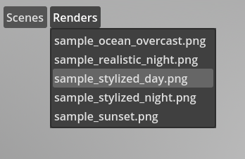

### 6. Saved files

Rendered panoramas are saved inside of `res://panoramas/`.

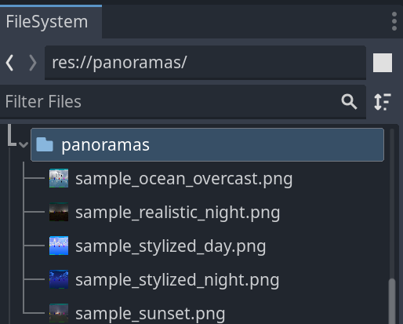

If you have selected the `Skybox` checkbox, rendered images will be saved inside the `res://panoramas/<scene_name>/`.

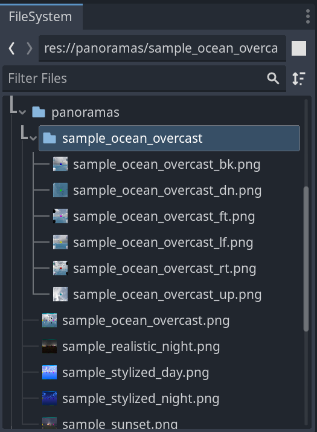

These images are compatible with "Quake" 1 and 2 in-game skybox rendering. Might also work in "Half-Life 1", but has not been tested. _Quake and Half-Life are copyright their respective owners, and are not related to this project in any way_.

To view how this process works in action check out this video: https://youtu.be/Xmk56k_vyZk

And this should conclude the general introduction to the features available.

## Future plans

I have loose "short term" plans to turn this stand-alone project into a Godot Plugin, and distribute it on the Godot Asset Library.

Another "loose" plan, is to turn this project into a stand-alone executable with some added procedural panorama generation features. No promises.

## License

Project is released under the `MIT` license: ["link to license"](/LICENSE)

## Credits

### Camera360

The project makes use of the ["Camera 360" Godot project](https://github.com/victorbstan/godot4_camera_360), which was originally forked from: https://github.com/BastiaanOlij/godot_camera_360 created by Bastiaan Olij.

### HDRi Images

This project includes some images which are freely available under very permissive license [CC0](https://polyhaven.com/license) from [Poly Haven](https://polyhaven.com/a/belfast_sunset_puresky).

### Stylized Sky

This project also makes use of the `Stylized Sky` Godot project assets: https://github.com/gdquest-demos/godot-4-stylized-sky
